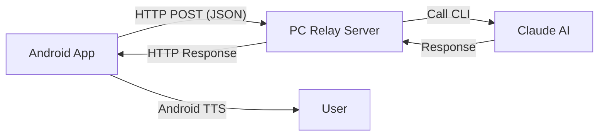

# Claude Voice Integration 🎙️🤖

[](https://opensource.org/licenses/MIT)
[]()
[]()

A powerful, low-latency Android application that provides a voice-first interface to Claude AI. This project consists of a high-performance Android APK and a lightweight PC relay server, enabling seamless Push-to-Talk (PTT) communication with Claude from your mobile device.


*(Note: Replace this with a high-quality screenshot or architectural diagram)*

## ✨ Key Features

- **🔴 Push-to-Talk (PTT):** Intuitive mic button with visual feedback and haptic support.
- **⚡ Low Latency:** Optimized HTTP relay for near-instant responses.
- **🗣️ On-Device STT:** Uses Android's native Speech-to-Text for reliable transcription.
- **🔊 Auto-TTS:** Automatically reads back Claude's responses using high-quality system voices.
- **🖼️ Floating Overlay:** A convenient bubble overlay to trigger Claude from any app.
- **⚙️ Configurable:** Easily adjust PC server IP, port, and voice settings via the in-app settings menu.
- **🖥️ PC Relay Server:** A simple Flask-based server that bridges the app to your local Claude environment.

## 🏗️ Architecture



## 🚀 Getting Started

### 1. Prerequisites
- **Android Device:** Android 8.0 (Oreo) or higher.
- **PC Server:** Python 3.x installed.
- **Claude CLI:** Ensure you have access to Claude via a CLI tool (configured on your PC).

### 2. PC Server Setup
1. Navigate to the `pc_server` directory.
2. Install dependencies:
   ```bash
   pip install flask
   ```
3. Run the server:
   ```bash
   python3 claude_webhook_server.py
   ```
   *The server will start on port 5000 by default.*

### 3. Android App Installation
1. **Download the APK:** Grab the latest `app-debug.apk` from the [Releases](https://github.com/jerimie81/claude-voice-integration-apk/releases) page.
2. **Install:** Use ADB or transfer the file to your device:
   ```bash
   adb install app-debug.apk
   ```
3. **Configure:** Open the app, go to Settings (⚙️), and enter your PC's local IP address and the server port.

## 🛠️ Development

### Building from Source
If you want to build the APK yourself:
```bash
cd android_app
./gradlew assembleDebug
```
The resulting APK will be located at `app/build/outputs/apk/debug/app-debug.apk`.

### Installer Script
A TUI installer is provided for Linux users to automate the PC-side setup:
```bash
chmod +x install.sh
./install.sh
```

## 🤝 Contributing
Contributions are welcome! Please feel free to submit a Pull Request.

## 📄 License
This project is licensed under the MIT License - see the [LICENSE](LICENSE) file for details.

---
*Created with ❤️ for the AI community.*
